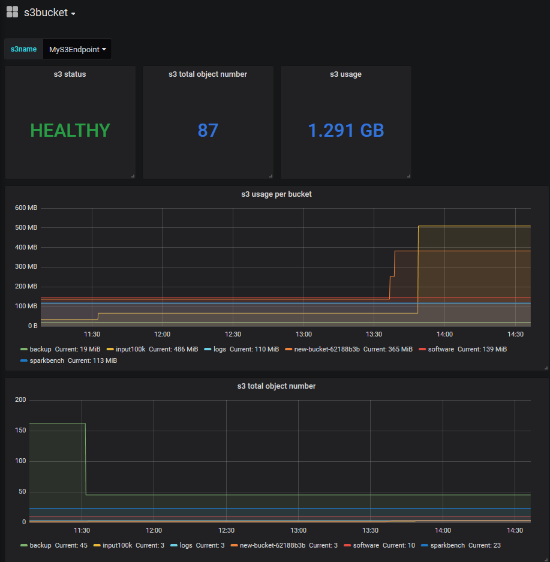

# S3bucket Exporter

s3bucket_exporter collects informations about size and object list about all the buckets accessible by user. Was designed to work with ceph, but should work will all S3 compatible endpoints.

## Badges

[](/LICENSE)
[](https://github.com/molu8bits/s3bucket_exporter/releases/latest)
[](https://somsubhra.github.io/github-release-stats/?username=molu8bits&repository=s3bucket_exporter)
[](https://github.com/molu8bits/s3bucket_exporter/actions/workflows/ci.yaml?branch=master&event=push)
[](https://github.com/molu8bits/s3bucket_exporter/actions/workflows/frogbot-scan-pr-go.yml)
[](https://github.com/jfrog/frogbot#readme)
[](https://goreportcard.com/report/github.com/molu8bits/s3bucket_exporter)


[](https://sonarcloud.io/summary/new_code?id=s3bucket_exporter)
[](https://sonarcloud.io/summary/new_code?id=s3bucket_exporter)
[](https://sonarcloud.io/summary/new_code?id=s3bucket_exporter)
[](https://codecov.io/github/molu8bits/s3bucket_exporter)

[](https://app.fossa.com/projects/custom%2B20660%2Fgithub.com%2Fmolu8bits%2Fs3bucket_exporter?ref=badge_large)

## Getting started

Run from command-line:

```sh
./s3bucket_exporter [flags]
```

Run from command-line - example with minimal parameter list:

```sh
./s3bucket_exporter -s3_endpoint=192.168.0.1:7480 -s3_access_key=akces123 -s3_secret_key=secret123 -s3_name=MyS3Endpoint
```

Run as docker container - example for local s3-like buckets with ssl disabled:

```sh
docker run -p 9655:9655 -d -e LISTEN_PORT=:9655 -e S3_DISABLE_SSL=True -e S3_ENDPOINT=192.168.0.1:7480 -e S3_ACCESS_KEY=akces123 -e S3_SECRET_KEY=secret123 -e S3_NAME=MyS3Endpoint docker.io/molu8bits/s3bucket_exporter:0.3 
```

Run from command-line - example for AWS
/*Please note that you need to have buckets only in one region. Otherwise script will fail with message "...BucketRegionError: incorrect region, the bucket is not in ..."*/

```sh
./s3bucket-exporter -s3_endpoint https://s3.us-east-1.amazonaws.com -listen_port :9655 -s3_access_key ABCD12345678 -s3_secret_key mySecretKey -s3_name=My2S3Endpoint --s3_region=us-east-1 --s3_force_path_style=false --s3_disable_endpoint_host_prefix=true
```

The exporter supports two different configuration ways: command-line arguments take precedence over environment variables.

As for available flags and equivalent environment variables, here is a list:

|     environment variable          |    argument                       |     description                                    |        default        |     example              |
| --------------------------------- | --------------------------------- | -------------------------------------------------- | --------------------- | ------------------------ |
| S3_NAME                           | -s3_name                         | S3 configuration name, visible as a tag            |                       | MyS3Endpoint             |
| S3_ENDPOINT                       | -s3_endpoint                     | S3 endpoint url with port  |                       |                       | 192.168.0.1:7480         |
| S3_ACCESS_KEY                     | -s3_access_key                   | S3 access_key (aws_access_key)                     |                       | myAkcesKey               |
| S3_SECRET_KEY                     | -s3_secret_key                   | S3 secret key (aws_secret_key)                     |                       | mySecretKey              |
| S3_REGION                         | -s3_region                       | S3 region name                                     | default               | "default" or "eu-west-1" |
| LISTEN_PORT                       | -listen_port                     | Exporter listen Port cluster                       | :9655                 | :9123                   |
| LOG_LEVEL                         | -log_level                       | Log level. Info or Debug                           | Info                  | Debug                    |
| S3_DISABLE_SSL                    | -s3_disable_ssl                  | If S3 endpoint is not secured by SSL set to True   | False                 | True                     |
| S3_DISABLE_ENDPOINT_HOST_PREFIX   | -s3_disable_endpoint_host_prefix | Disable endpoint host prefix                       | False                 | True                     |
| S3_FORCE_PATH_STYLE               | -s3_force_path_style             | Force use path style (bucketname not added to url) | True                  | False                    |

> Warning: For security reason is not advised to use credential from command line

## Prometheus configuration example:

```yaml
  - job_name: 's3bucket'
    static_configs:
    - targets: ['192.168.0.5:9655']
```

## Grafana

Grafana dashboad ([resources/grafana-s3bucket-dashboard.json] (resources/grafana-s3bucket-dashboard.json)):


